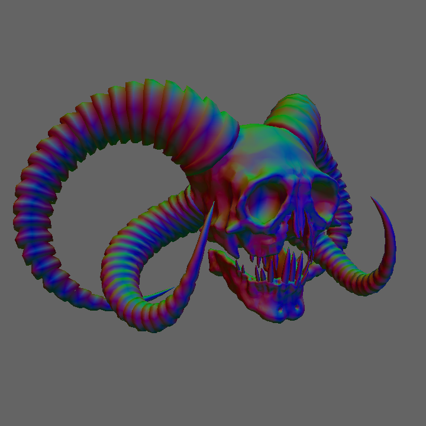
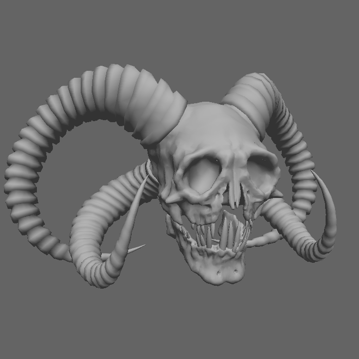
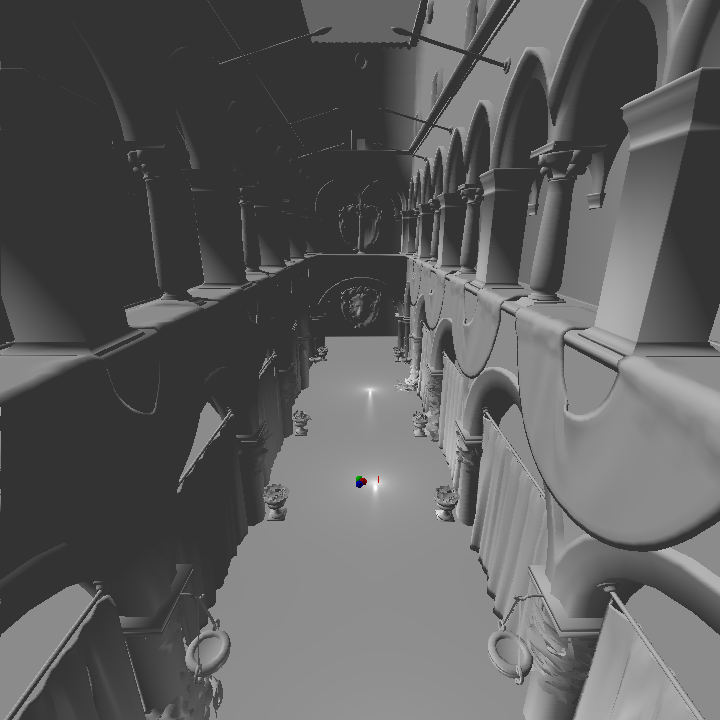

# Renderer

This is a CPU Renderer that renders objects using the CPU , you can use either a **ray tracer** or a **rasterizer** to render models, i made this project to learn the graphics pipeline and Windows API , although now it uses FSWindow , a windowing library i made for linux and windows. This project supports rendering OBJ files, with basic lighting (blinn-phong) and includes features for visualization and debugging.

### Controls
- **W, A, S, D**: Move the camera.
- **Space/CTRL**: Move the camera up/down.
- **SHIFT**: Increase moving speed.
- **Mouse**: Rotate the camera.
- **Key Bindings**:
  - `R`: Toggle ray tracing/rasterization.
  - `X`: Change lighting modes
  - `G`: Lock/unlock the mouse.
  - `N`: set debugstate to normal mode
  - `T`: set debugstate to wireframe mode
  - `V`: disable debugstate.
  - `M`: set debugstate to depth mode
  - `B`: Show/hide bounding boxes.
  - `C`: Toggle backface culling.
  - `P`: Export the current frame to a PPM file.
  - `Q`: Reset camera position and rotation.
  - `L`: Display model details.
  - `F`: Toggle FXAA anti-aliasing.
  - `ESC`: Exit the application.

## Building from source
### Windows
- install a clang, cmake and ninja <br>
```batch
winget install cmake
winget install LLVM.LLVM
winget install Ninja-build.Ninja
```
- clone the repo. <br>
```batch
git clone --recursive https://github.com/fahad-cpp/Renderer Renderer
cd Renderer

```
- build using cmake with ninja and run <br>
```batch
cmake -S . -B build -G "Ninja" -DCMAKE_BUILD_TYPE=Release -DCMAKE_CXX_COMPILER=clang++
cmake --build build --config Release
build\Renderer.exe

```
### Linux
- install a clang, cmake and ninja using your package manager <br>
```bash
sudo pacman -S clang ninja cmake lld

```
- clone the repo
```bash
git clone --recursive https://github.com/fahad-cpp/Renderer Renderer
cd Renderer

```
- build using cmake with ninja and run <br>
```bash
cmake -S . -B build -G "Ninja" -DCMAKE_BUILD_TYPE=Release -DCMAKE_CXX_COMPILER=clang++
cmake --build build --config Release
./build/Renderer

```
> **Note:** <br>on Wayland systems the mouse locking does not work so mouse will go out of window <br> disable mouse lock by pressing G

## Sample Outputs

### Ray Tracing
- **White King**: A ray-traced render of a chess piece.


- **Spheres**: Reflection on spheres rendered using ray tracing.


### Rasterization
- **Demon Skull Normals**: Render time : ~8ms <br>


- **Demon Skull**: Render time : ~8ms <br>


- **Sponza**: Render time : ~40ms <br>

